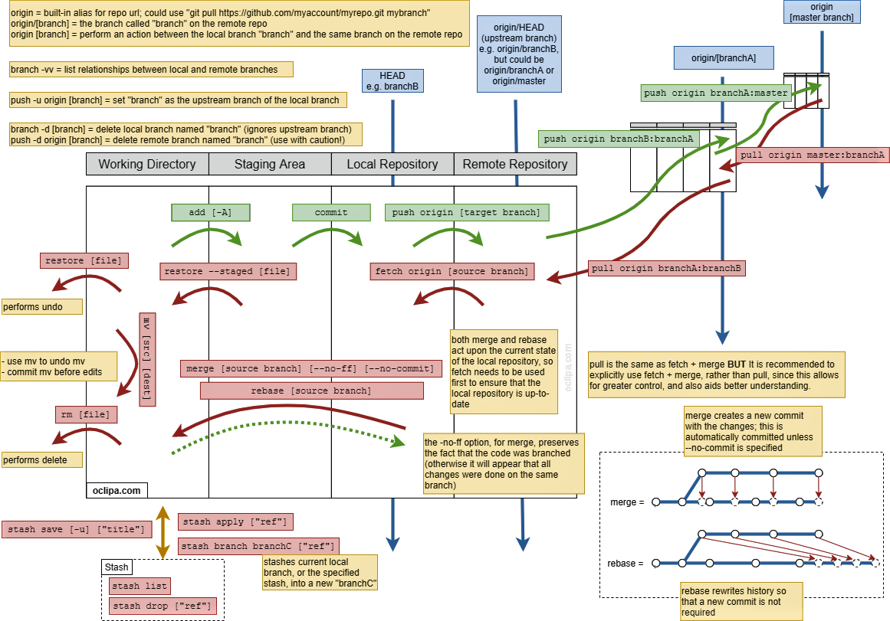
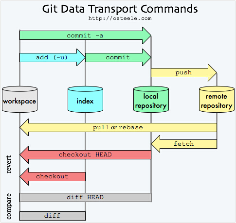
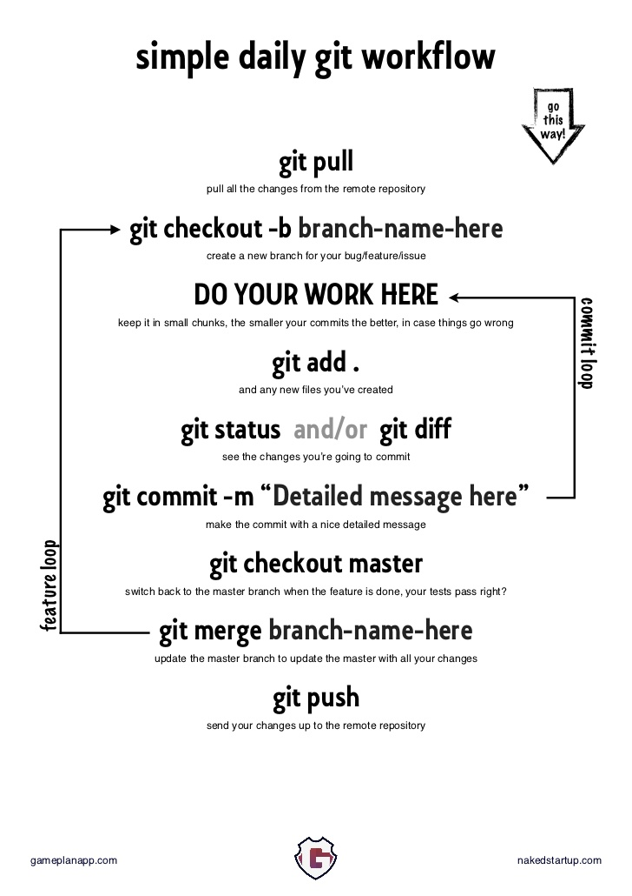
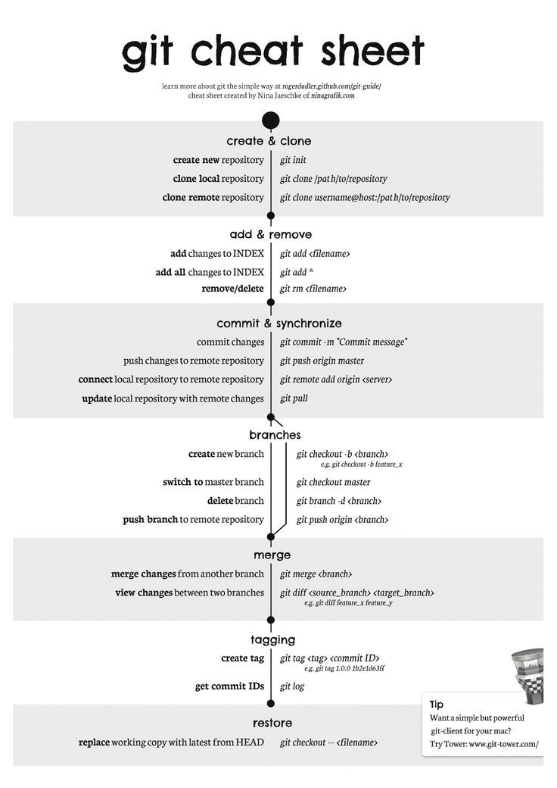

<a class="link" href="http://oclipa.github.io/">&lt; home</a>
<a class="link" href="http://oclipa.github.io/toolbox.html">&lt; toolbox</a>

 

* https://blog.thoughtram.io/git/rebase-book/2015/02/10/understanding-branches-in-git.html

## The Daily Routine

| Command | Action |
| :------- | :------- |
| `git pull`| Pull all remote changes from current branch |
| `git checkout -b [branch-name-here]`| Create a new branch, from the current branch, for your bug/feature/issue |
| `git add .`| Add any changed files to the staging index |
| `git status`| See the current status of the workspace |
| `git diff [source branch] [target branch]`| Show changes |
| `git commit -m "Detailed message here"`| Make the commit have a nice, detailed message |
| `git push`| Push your changes onto the current branch |
| `git request-pull master ./`| Request review of latest changes in current branch compared to master |
| `git checkout master`| Switch back to the master branch when the feature is done and tested |
| `git merge [branch-name-here]`| Merge all changes from the specified branch into the master branch |
| `git push`| Push your merged changes onto the master branch |
|  |  |

 

## Additional Actions

| Command | Action |
| :------- | :------- |
| `git init`| Initialize the current folder as a repository |
| `git clone [/path/to/repo]` | Clone local repository |
| `git clone [url]`| Clone a remote repository |
| `git rm [file]`| Remove/delete a file |
| `git push origin [branch]` | Push changes to a specific branch |
| `git branch -d [branch-name-here]` | Delete a branch |
| `git tag [tag] [commit ID]` | Create a tag |
| `git log`| Display the git log |
| `git checkout -- [filename]`| Restore working copy with latest from HEAD |
| `git revert [commit ID]`| Rollback to the specified commit (preferred method for reverting a change) |
| `git reset --soft [HEAD or commit ID]`| Discarding intervening commits. Reset the HEAD to another commit but do not alter the index or working directory. All changes between original HEAD and commit will be staged. |
| `git reset --mixed [HEAD or commit ID]`| Discarding intervening commits and adds. Reset the HEAD and index to another commit but do not alter the working directory. All staged changes are removed from the index. |
| `git reset --hard [HEAD or commit ID]`| Discarding intervening commits, adds and changes to files in local worksapce. Reset the HEAD, index and workspace to another commit. All changes between original HEAD and commit will be staged Avoid using with shared repos. |
| `git commit --amend`| Allow the message for the most recent commit to be edited |
| `git rebase [branch-name]`| Similar to merge but more dangerous in shared repos.  Appends the current branch to the specified branch.  Main advantage is cleaner history. |
| `git clean -n`| Perform a dry run of clean |
| `git clean --force`| Clean all untracked files in the workspace |
| `git clean --force -d`| Clean all untracked files and directories in the workspace |
| `git clean --force -dx`| Clean all untracked **and ignored** files and directories in the workspace |
|  |  |

 

   
<button type="button" class="collapsible">+ Enable SSH for GitHub</button>

The main advantage of enabling SSH, rather than just using HTTPS, is that a username and password does not need to be entered for every action.
  
1. Generate a new SSH key: 
   * `ssh-keygen -t rsa -b 4096 -C "your_github_email@example.com"`
1. Start the SSH agent: 
   * `eval $(ssh-agent -s)`
1. Add the private key to the SSH agent: 
   * `ssh-add ~/.ssh/id_rsa`
1. Copy the contents of ~/.ssh/id_rsa.pub (the public key) to the clipboard
1. On github.com, Profile Picture -> Settings -> SSH and GPG keys -> New SSH Key -> Paste the key into the Key field and give it an identifying name -> Add SSH Key
1. Test the connection: `ssh -T git@github.com`
   * If this fails, try: `ssh -T -p 443 git@ssh.github.com`
   * Further info: https://help.github.com/en/github/authenticating-to-github/connecting-to-github-with-ssh
1. Once access is working, restart all terminals and applications that may wish to use Git via SSH (such as Visual Studio Code).
  
**Note:** The SSH agent must be running whenever you want to use SSH (so you may want to add the start-up command to your OS's start-up routines).

   
<button type="button" class="collapsible">+ Git Architecture &amp; Terminology</button>

   * **Staging Index:** Add file to repo index in preparation for commit
   * **Commit:** Copy all staged files to the local repo database
   * **Push:** Copy all commited changes to the remote repo database
   * **Pull:** Copy latest changes from remote repo into local repo
   * **HEAD:** The current branch or commit referenced by the local repo
   * **Checkout:** Redirect the HEAD to point to a specific commit or branch (or fetch a specific file, which doesn't change the HEAD).
   * **Detached HEAD:** When the HEAD is pointing at a specific commit.  Changes cannot be submitted in this case. 

 [Original Image](https://blog.osteele.com/2008/05/my-git-workflow/)
&copy; Oliver Steele: [https://osteele.com/](https://osteele.com/)

 

   
<button type="button" class="collapsible">+ An Example Simple Workflow</button>

 [Original Image](http://nakedstartup.com/2010/04/simple-daily-git-workflow)
&copy; Naked Startup: [http://nakedstartup.com/](http://nakedstartup.com/)

 

   
<button type="button" class="collapsible">+ An Example Of A More Complex Workflow</button>

 [Original Image](http://rogerdudler.github.io/git-guide/)
&copy; Roger Dudler: [https://twitter.com/rogerdudler](https://twitter.com/rogerdudler)

 

   
<button type="button" class="collapsible">+ Further Details</button>

[Git Further Details (pdf)](/assets/pdfs/git-more-details.pdf)
 &copy; Atlassian: [https://www.atlassian.com/git/tutorials/atlassian-git-cheatsheet](https://www.atlassian.com/git/tutorials/atlassian-git-cheatsheet)

&nbsp;

&nbsp;

&nbsp;

------
**Move along; nothing to see here...**

