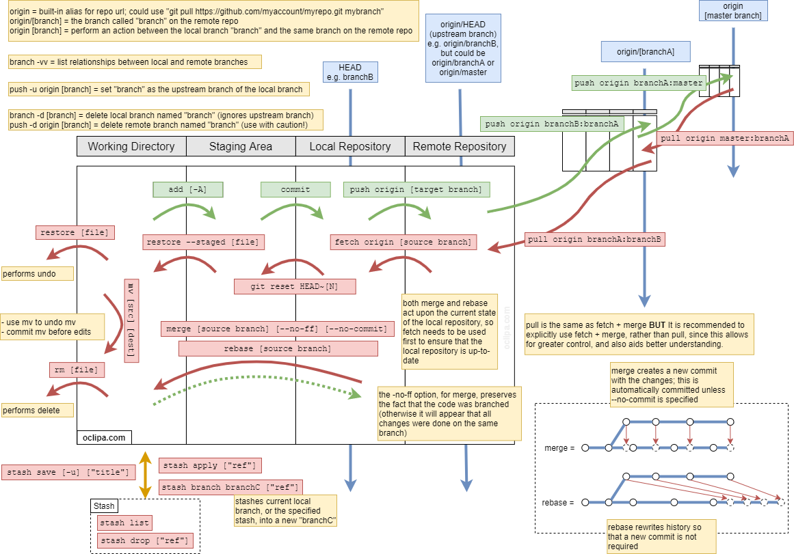

<a class="link" href="http://oclipa.github.io/">&lt; home</a>
<a class="link" href="http://oclipa.github.io/toolbox.html">&lt; toolbox</a>

 

## Summary

A summary of the main features of Git:

 

## A Daily Routine

| Command | Action |
| :------- | :------- |
| `git fetch origin [upstream-branch]`| Fetch all changes from the specified branch into the current branch |
| `git merge origin/[upstream-branch]`| Merge all changes from the specified branch into the current branch |
| `git branch [branch]` | Create a new branch, from the current branch, for your bug/feature/issue |
| `git switch [branch]` | Switch to the new branch |
| - | Make changes |
| `git add .`| Add any changed files to the staging index |
| `git status`| See the current status of the workspace |
| `git diff [source branch] [target branch]`| Show changes |
| `git commit -m "message"`| Make the commit have a nice, detailed message |
| `git branch -vv` | Display local branches and the remote branches to which they are mapped |
| `git push [-u] origin/[upstream-branch]`| Push your changes to an upstream branch (`-u` = create the upstream branch into which changes will be pushed) |
| `git request-pull [upstream-branch] origin [branch]`| Request review of latest changes in a branch compared to an upstream branch so that they can be pulled into the upstream branch Note: typically, it is simpler to do this from a GUI tool! |
|  |  |

## Additional Commands

**Initializing**

| Command | Action |
| :------- | :------- |
| `git init`| Initialize the current folder as a repository |
| `git clone [/path/to/repo]` | Clone a local repository |
| `git clone [url]`| Clone a remote repository |
| `git mv [file]`| Move a tracked file |
| `git tag [tag] [commit ID]` | Create a tag |
| `git log --all --graph --decorate --oneline`| Display the git log |
|  |  |

**Branching**

| Command | Action |
| :------- | :------- |
| `git branch`| List local branches |
| `git branch -a`| List both local and remote branches |
| `git branch [branch]`| Create a new local branch |
| `git branch -m [old-branch] [new-branch]`| Rename a local branch |
| `git branch -d [branch]`| Delete a local branch |
| `git branch -vv`| List all local branches and their mapped upstream branches |
|  |  |

**Diffing**

| Command | Action |
| :------- | :------- |
| `git diff`| Display differences between the working area and the index |
| `git diff HEAD`| Display differences between the working area and the HEAD |
| `git diff --staged HEAD`| Display differences between the index and the HEAD |
| `git diff -- [file]`| Display differences for a specific file between the working area and the HEAD |
| `git diff ###### HEAD`| Display differences between a specific commit and the HEAD |
| `git diff HEAD HEAD^`| Display differences between the commit at the top of the HEAD and the preceeding commit |
| `git diff ###### ######`| Display differences between two commits |
| `git diff [branch] origin/[branch]`| Display differences between the local branch and a remote branch |
|  |  |

**Stashing**

| Command | Action |
| :------- | :------- |
| `git stash`| Save all uncommited changes (excluding untracked files) in the stash |
| `git stash save [-u] ["text"]`| Save all uncommited changes (-u = including untracked files) in a stash with description "text"  |
| `git list`| Show the contents of the stash (note: each entry has a reference with format `stash@{#}`) |
| `git stash apply ["ref"]`| Restore the last stash (or the stash with reference "ref") |
| `git stash drop ["ref"]`| Delete the last stash (or the stash with reference "ref") |
| `git stash pop ["ref"]`| Restore the last stash (or the stash with reference "ref") and then delete it from the stash |
| `git stash show ["ref"]`| Show the last stash (or the stash with reference "ref") |
| `git stash clear`| Clear all stash entries |
|  |  |

**Undoing**

| Command | Action |
| :------- | :------- |
| `git restore [filename]`| Restore working copy with latest from HEAD |
| `git revert [commit ID]`| Rollback to the specified commit (preferred method for reverting a change) |
| `git reset --soft [HEAD or commit ID]`| Discarding intervening commits. Reset the HEAD to another commit but do not alter the index or working directory. All changes between original HEAD and commit will be staged. |
| `git reset --mixed [HEAD or commit ID]`| Discarding intervening commits and adds. Reset the HEAD and index to another commit but do not alter the working directory. All staged changes are removed from the index. |
| `git reset --hard [HEAD or commit ID]`| Discarding intervening commits, adds and changes to files in local worksapce. Reset the HEAD, index and workspace to another commit. All changes between original HEAD and commit will be staged Avoid using with shared repos. |
| `git commit --amend`| Allow the message for the most recent commit to be edited |
|  |  |

**Cleaning Up**

| Command | Action |
| :------- | :------- |
| `git rm [file]`| Remove a tracked file from the repository and delete it |
| `git branch -d [branch]` | Delete a local branch |
| `git push -d origin [branch]` | Delete a remote branch - use with care! |
| `git clean -n`| Perform a dry run of clean |
| `git clean --force`| Clean all untracked files in the workspace |
| `git clean --force -d`| Clean all untracked files and directories in the workspace |
| `git clean --force -dx`| Clean all untracked **and ignored** files and directories in the workspace |
| `git rebase [branch-name]`| Similar to merge but more dangerous in shared repos.  Appends the current branch to the specified branch.  Main advantage is cleaner history. |
|  |  |

**Other**

| Command | Action |
| :------- | :------- |
| `git mv [file]`| Move a tracked file |
| `git tag [tag] [commit ID]` | Create a tag |
| `git log --all --graph --decorate --oneline`| Display the git log |
|  |  |

 

   
<button type="button" class="collapsible">+ Enable SSH for GitHub</button>

The main advantage of enabling SSH, rather than just using HTTPS, is that a username and password does not need to be entered for every action.
  
1. Generate a new SSH key: 
   * `ssh-keygen -t rsa -b 4096 -C "your_github_email@example.com"`
1. Start the SSH agent: 
   * `eval $(ssh-agent -s)`
1. Add the private key to the SSH agent: 
   * `ssh-add ~/.ssh/id_rsa`
1. Copy the contents of ~/.ssh/id_rsa.pub (the public key) to the clipboard
1. On github.com, Profile Picture -> Settings -> SSH and GPG keys -> New SSH Key -> Paste the key into the Key field and give it an identifying name -> Add SSH Key
1. Test the connection: `ssh -T git@github.com`
   * If this fails, try: `ssh -T -p 443 git@ssh.github.com`
   * Further info: https://help.github.com/en/github/authenticating-to-github/connecting-to-github-with-ssh
1. Once access is working, restart all terminals and applications that may wish to use Git via SSH (such as Visual Studio Code).
  
**Note:** The SSH agent must be running whenever you want to use SSH (so you may want to add the start-up command to your OS's start-up routines).

   
<button type="button" class="collapsible">+ Further Details</button>

* [https://git-scm.com/docs](Git Documentation)
* [https://www.atlassian.com/git/tutorials/atlassian-git-cheatsheet](Atlassian Git Cheatsheet)
* [https://blog.thoughtram.io/git/rebase-book/2015/02/10/understanding-branches-in-git.html](Understanding Branches in Git)

&nbsp;

&nbsp;

&nbsp;

------
**Move along; nothing to see here...**

<!-- Default Statcounter code for git-cheat-sheet
https://oclipa.github.io/git-cheat-sheet/ -->

<noscript>

</noscript>
<!-- End of Statcounter Code -->
